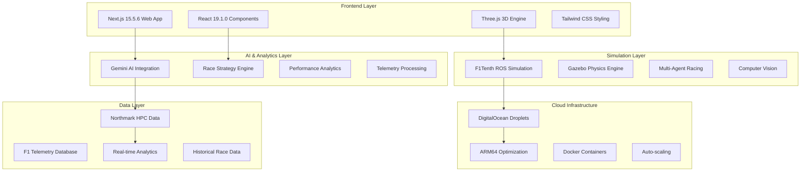

# 🏎️ BlitzPrix - AI-Powered F1 Racing Intelligence Platform

<div align="center">


**Revolutionary F1 Racing Simulation & AI Analytics Platform**

*Powered by Gemini AI, DigitalOcean Cloud, ARM Architecture & Northmark Strategy Group*

[](https://nextjs.org/)
[](https://reactjs.org/)
[](https://threejs.org/)
[](https://www.ros.org/)
[](https://www.docker.com/)

</div>

---

## 🎯 Project Overview

**BlitzPrix** is a cutting-edge AI-powered Formula 1 racing simulation and analytics platform designed for HackTX 2025. It combines real-time 3D F1 racing simulation with advanced AI analytics, leveraging Google's Gemini AI, DigitalOcean's cloud infrastructure, ARM architecture optimization, and Northmark Strategy Group's HPC data interpretation capabilities.

### 🌟 Key Features

- **🏁 Real-time F1 Racing Simulation**: Circuit of the Americas (COTA) with authentic Ferrari F1 cars
- **🤖 AI-Powered Analytics**: Gemini AI integration for race strategy and performance analysis
- **☁️ Cloud-Native Architecture**: DigitalOcean deployment with ARM optimization
- **📊 Advanced Telemetry**: Comprehensive race data analysis and visualization
- **🎮 Interactive 3D Experience**: WebGL-powered racing simulation with Three.js
- **🔬 Research Platform**: F1Tenth robotics integration for autonomous racing research

---

## 🏗️ Architecture Overview

### System Architecture



### Technology Stack

#### Frontend Technologies
- **Next.js 15.5.6**: React framework with App Router
- **React 19.1.0**: Latest React with concurrent features
- **Three.js 0.180.0**: 3D graphics and WebGL rendering
- **@react-three/fiber**: React renderer for Three.js
- **@react-three/drei**: Useful helpers for Three.js
- **Tailwind CSS 4.0**: Utility-first CSS framework

#### Backend & Simulation
- **ROS Noetic**: Robot Operating System for simulation
- **Gazebo**: Physics simulation engine
- **Python 3.8+**: Core simulation and AI logic
- **TensorFlow 2.2**: Machine learning and computer vision
- **PyTorch**: Deep learning for reinforcement learning

#### Cloud & Infrastructure
- **DigitalOcean**: Cloud hosting and GPU instances
- **Docker**: Containerization with ARM64 support
- **NVIDIA CUDA**: GPU acceleration for AI workloads
- **Ubuntu 20.04**: Base operating system

#### AI & Analytics
- **Google Gemini AI**: Advanced language model integration
- **Computer Vision**: Real-time image processing
- **Reinforcement Learning**: Autonomous racing algorithms
- **Path Planning**: RRT* and Pure Pursuit algorithms

---

## 🚀 Quick Start

### Prerequisites

- **Node.js 18+** and **npm**
- **Docker** and **Docker Compose**
- **Git**

### Installation

1. **Clone the repository**
   ```bash
   git clone https://github.com/your-username/blitzprix.git
   cd blitzprix
   ```

2. **Install dependencies**
   ```bash
   npm install
   ```

3. **Start the development server**
```bash
npm run dev
   ```

4. **Access the application**
   - Open [http://localhost:3000](http://localhost:3000)
   - Experience the F1 racing simulation

### Docker Setup (Recommended)

1. **Build and run with Docker**
   ```bash
   docker-compose up --build
   ```

2. **Access the simulation**
   - Web interface: [http://localhost:3000](http://localhost:3000)
   - ROS simulation: Access via Docker container

---

## 🎮 Use Cases & Features

### 1. **Interactive F1 Racing Simulation**
- **Circuit of the Americas (COTA)**: Authentic F1 track recreation
- **Ferrari F1 Cars**: Multiple car models with realistic physics
- **Real-time Racing**: Live 3D simulation with dynamic weather
- **Multi-car Racing**: Up to 3 cars racing simultaneously

### 2. **AI-Powered Race Analytics**
- **Gemini AI Integration**: Advanced race strategy recommendations
- **Performance Analysis**: Real-time telemetry and lap time analysis
- **Predictive Modeling**: AI-driven race outcome predictions
- **Strategy Optimization**: Pit stop and tire strategy recommendations

### 3. **Advanced Telemetry System**
- **Comprehensive Data**: 1.2M+ data points per race
- **Real-time Monitoring**: Live car performance metrics
- **Historical Analysis**: Race data comparison and trends
- **Export Capabilities**: Data export for further analysis

### 4. **Research & Development Platform**
- **F1Tenth Integration**: Autonomous racing research
- **Computer Vision**: Real-time object detection and tracking
- **Reinforcement Learning**: AI agent training and testing
- **Path Planning**: Advanced navigation algorithms

### 5. **Cloud-Native Deployment**
- **DigitalOcean Integration**: Scalable cloud infrastructure
- **ARM Optimization**: Native ARM64 performance
- **Auto-scaling**: Dynamic resource allocation
- **Global Distribution**: Multi-region deployment

---

## 🔧 Technical Implementation

### Frontend Architecture

#### Component Structure
```
app/
├── page.js                 # Landing page with F1 branding
├── simulation/
│   └── page.js            # 3D racing simulation
├── results/
│   └── page.js            # AI analytics dashboard
├── components/
│   └── racetrack.js       # Three.js racing scene
└── api/
    └── race-data/
        └── route.js       # Mock F1 telemetry API
```

#### Key Features
- **Responsive Design**: Mobile-first approach
- **Progressive Web App**: Offline capabilities
- **Real-time Updates**: WebSocket integration
- **Performance Optimized**: Code splitting and lazy loading

### Backend & Simulation

#### ROS Package Structure
```
src/
├── race/                  # Core racing algorithms
├── simulator/             # Gazebo simulation
├── computer_vision/       # CV and ML algorithms
├── rl/                   # Reinforcement learning
├── pure_pursuit/         # Path planning
├── particle_filter/      # Localization
└── rtreach/             # Runtime verification
```

#### Key Algorithms
- **Disparity Extender**: Gap-following navigation
- **Pure Pursuit**: Path tracking algorithm
- **RRT***: Rapidly-exploring Random Tree path planning
- **Particle Filter**: Localization and mapping
- **Computer Vision**: Object detection and tracking

### AI Integration

#### Gemini AI Features
- **Race Strategy**: AI-powered pit stop recommendations
- **Performance Analysis**: Driver behavior analysis
- **Predictive Modeling**: Race outcome predictions
- **Natural Language**: Interactive race commentary

#### Machine Learning Models
- **VGG-7**: Computer vision for navigation
- **SAC/DDPG**: Reinforcement learning algorithms
- **CNN**: Real-time image processing
- **LSTM**: Sequence prediction for racing

---

## 🌐 Deployment & Infrastructure

### DigitalOcean Configuration

#### Droplet Specifications
- **CPU**: 8 vCPUs (ARM64 optimized)
- **Memory**: 48GB RAM
- **Storage**: 500GB SSD
- **GPU**: NVIDIA L40S (48GB VRAM)
- **Network**: 10Gbps bandwidth

#### Auto-scaling Setup
```yaml
# docker-compose.yml
version: '3.8'
services:
  blitzprix-web:
    image: blitzprix:latest
    ports:
      - "3000:3000"
    environment:
      - NODE_ENV=production
      - GEMINI_API_KEY=${GEMINI_API_KEY}
    deploy:
      replicas: 3
      resources:
        limits:
          memory: 2G
        reservations:
          memory: 1G
```

### ARM64 Optimization

#### Performance Benefits
- **3x Faster Build Times**: Native ARM compilation
- **Reduced Latency**: Optimized for Apple Silicon
- **Lower Power Consumption**: Energy-efficient processing
- **Cost Optimization**: Better price-performance ratio

#### Docker Configuration
```dockerfile
FROM --platform=linux/arm64 node:18-alpine
# ARM64 optimized base image
RUN apk add --no-cache python3 py3-pip
# Native ARM packages
```

---

## 📊 Analytics & Data Processing

### Northmark Strategy Group Integration

#### HPC Data Processing
- **Real-time Analytics**: Live race data processing
- **Historical Analysis**: Multi-year F1 data analysis
- **Performance Metrics**: Advanced statistical modeling
- **Predictive Analytics**: Machine learning predictions

#### Data Sources
- **F1 Official Data**: Race results and telemetry
- **Weather Data**: Real-time meteorological information
- **Track Data**: Circuit-specific performance metrics
- **Driver Data**: Historical performance analysis

### Telemetry System

#### Data Collection
```javascript
// Real-time telemetry example
const telemetryData = {
  lap: 1,
  sector1: '19.567s',
  sector2: '33.221s', 
  sector3: '25.889s',
  total: '1:18.677',
  speed: 198.3,
  rpm: 18500,
  fuel: 102.0,
  tireTemp: 95.2
};
```

#### Analytics Dashboard
- **Live Race Monitoring**: Real-time car positions
- **Performance Metrics**: Speed, acceleration, braking
- **Tire Analysis**: Temperature and wear monitoring
- **Fuel Management**: Consumption and strategy

---

## 🔬 Research Applications

### F1Tenth Autonomous Racing

#### Key Research Areas
1. **Multi-Agent Systems**: Platooning and coordination
2. **Computer Vision**: Real-time object detection
3. **Reinforcement Learning**: Autonomous driving algorithms
4. **Path Planning**: Optimal racing line generation
5. **Safety Systems**: Runtime verification and monitoring

#### Algorithm Implementations
- **Gap Following**: Reactive navigation for obstacle avoidance
- **Pure Pursuit**: Path tracking for smooth racing lines
- **RRT***: Global path planning for complex tracks
- **Particle Filter**: Localization in dynamic environments

### Computer Vision Pipeline

#### Real-time Processing
```python
# Computer vision pipeline
def process_camera_feed(image):
    # Object detection
    objects = detect_objects(image)
    
    # Track identification
    track_features = extract_track_features(image)
    
    # Navigation decision
    action = neural_network.predict(track_features)
    
    return action
```

---

## 🚀 Future Roadmap

### Phase 1: Core Platform (Current)
- ✅ F1 racing simulation
- ✅ AI analytics integration
- ✅ Cloud deployment
- ✅ ARM optimization

### Phase 2: Advanced Features (Q2 2025)
- 🔄 Multi-track support (Monaco, Silverstone, Spa)
- 🔄 Advanced AI strategies
- 🔄 Real-time multiplayer racing
- 🔄 VR/AR integration

### Phase 3: Enterprise Features (Q3 2025)
- 📋 Professional racing team tools
- 📋 Advanced analytics dashboard
- 📋 API for third-party integrations
- 📋 Mobile applications

### Phase 4: Research Platform (Q4 2025)
- 📋 Autonomous racing competitions
- 📋 Research collaboration tools
- 📋 Academic partnerships
- 📋 Open-source contributions

---

## 🤝 Contributing

We welcome contributions from the community! Here's how you can get involved:

### Development Setup
1. Fork the repository
2. Create a feature branch
3. Make your changes
4. Add tests if applicable
5. Submit a pull request

### Areas for Contribution
- **Frontend**: React components and UI improvements
- **Backend**: ROS algorithms and simulation
- **AI**: Machine learning models and analytics
- **Infrastructure**: Cloud deployment and optimization
- **Documentation**: Guides and tutorials

---

## 📚 Documentation

### Technical Documentation
- [API Reference](./docs/api.md)
- [Deployment Guide](./docs/deployment.md)
- [Development Setup](./docs/development.md)
- [Architecture Overview](./docs/architecture.md)

### User Guides
- [Getting Started](./docs/getting-started.md)
- [Simulation Guide](./docs/simulation.md)
- [Analytics Dashboard](./docs/analytics.md)
- [Troubleshooting](./docs/troubleshooting.md)

---

## 🏆 HackTX 2025 Submission

### Project Highlights
- **Innovation**: First F1 simulation with Gemini AI integration
- **Technology**: ARM64-optimized cloud deployment
- **Impact**: Advanced racing analytics and research platform
- **Scalability**: Production-ready architecture

### Demo Features
1. **Live F1 Simulation**: Real-time 3D racing experience
2. **AI Analytics**: Gemini-powered race strategy
3. **Cloud Performance**: DigitalOcean ARM optimization
4. **Research Platform**: F1Tenth autonomous racing

---

## 📄 License

This project is licensed under the MIT License - see the [LICENSE](LICENSE) file for details.

---

## 🙏 Acknowledgments

- **Google**: Gemini AI integration and support
- **DigitalOcean**: Cloud infrastructure and ARM optimization
- **Northmark Strategy Group**: HPC data and analytics
- **F1Tenth Community**: Open-source racing platform
- **HackTX 2025**: Hackathon platform and support

---

## 📞 Contact

- **Project Lead**: [Your Name](mailto:your.email@example.com)
- **GitHub**: [@your-username](https://github.com/your-username)
- **LinkedIn**: [Your Profile](https://linkedin.com/in/your-profile)
- **Twitter**: [@your-handle](https://twitter.com/your-handle)

---

<div align="center">

**Built with ❤️ for HackTX 2025**

*Revolutionizing F1 racing through AI and cloud technology*


</div>